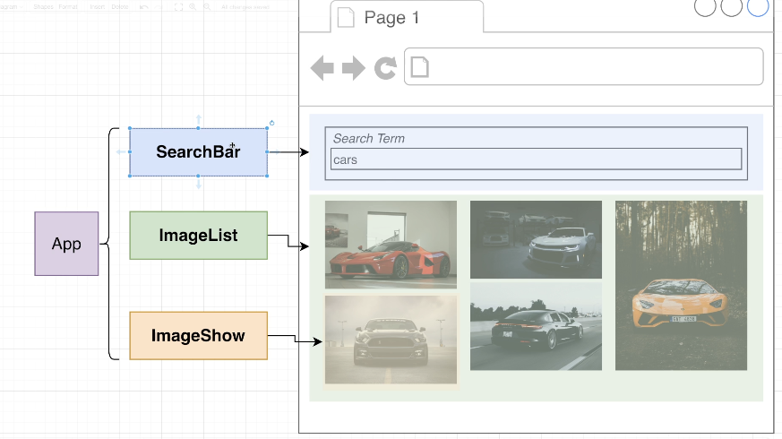
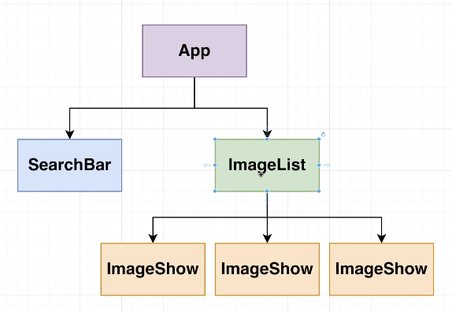
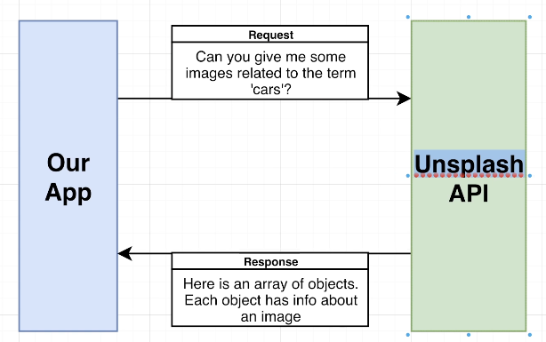
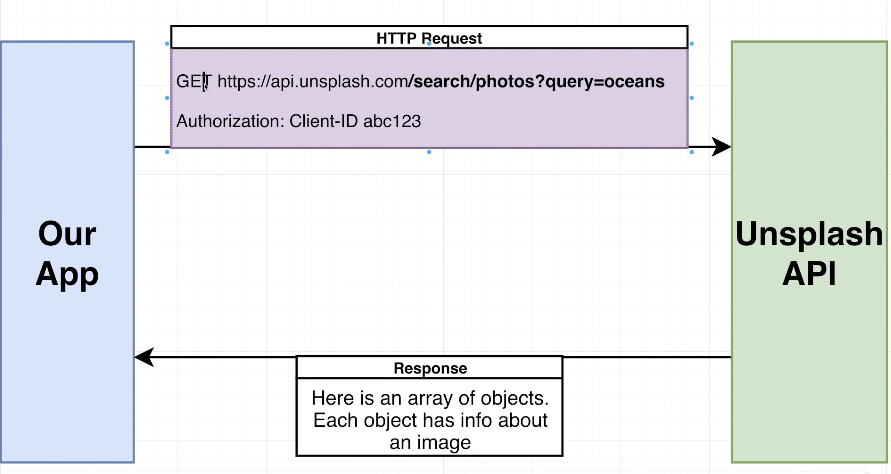
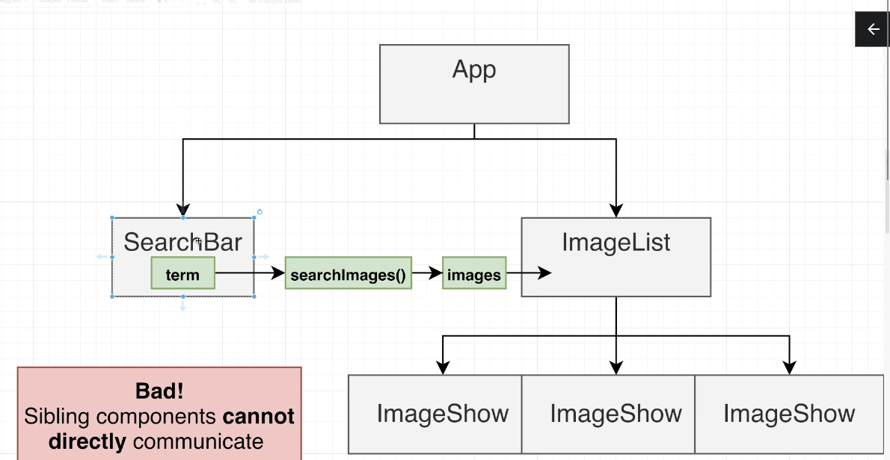
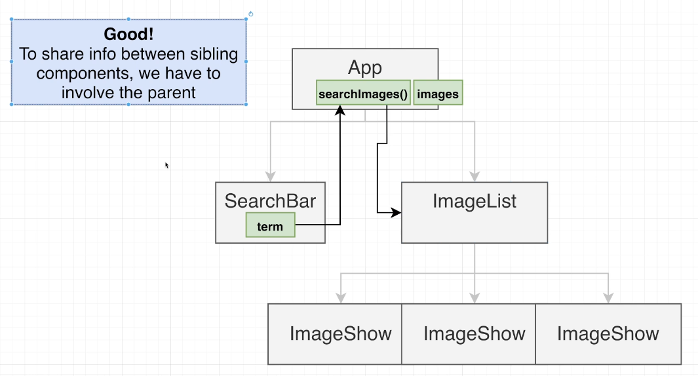

# API cars project
Create a web page that makes a request to an API and displays the images returned based on a search term

## Folder structure
src/   
--index.js  
--App.js  
--components/  
----SearchBar.js   
----ImageShow.js  
----ImageList.js  

## REST Process

## Unsplash API
1. Register for account
2. Request for API Key
3. Create new app
4. Get keys

Schema: https://api.unsplash.com

Public authentication -> Send authorization header
Authorization: Client-ID ACCESS-KEY
Search prohos: GET /search/photos 
    query: Search terms
    page: Page number to retrieve

## Flujo de datos en React
1. La barra de busqieda contiene el texto que un usuario usara para buscar
2. Cuando el usuario presione enter, hara una busqueda
3. Tenemos una funcion que convertira dicho termino en un arreglo de objetos imagenes
4. Dicho arreglo de imagenes necesitamos leerlo en el componente ImageList

**Los componentes hermanos no se pueden comunicar (Tienen el mismo padre), la comunicacion debe pasar por el padre**
