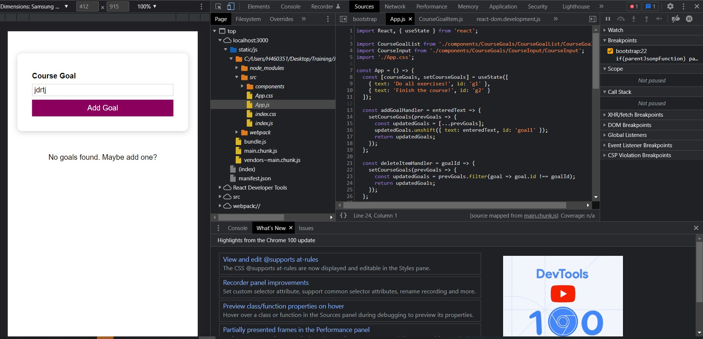

# Debugging react errors

## Adjacent JSX elements must be wrapped in an enclosing tag
Significa que 2 componentes hermanos en el codigo no tienen un componente padre, recordemos que las instrucciones return solo pueden devolver un componente raiz.

## 'SOMETHING' is not defined
Estamos tratando de usar variables no definidas, probablemente un error de tipografia. Usar el nombre correcto.

## Adding breakpoints
En las herramientas de desarrollador
    -   Sources
    -   static
    -   C:/Users/...
    -   src
Encontramos nuestro codigo al cual podemos añadirle breakpoints y ejecutar linea a linea el codigo en el navegador

*Uso del debugger en chrome*